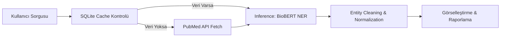
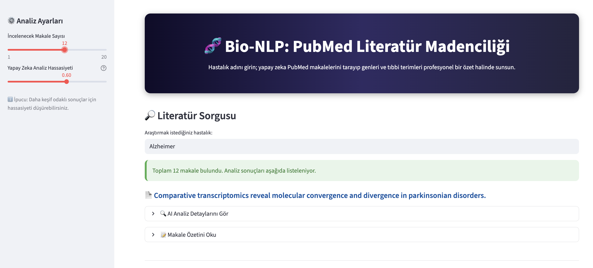
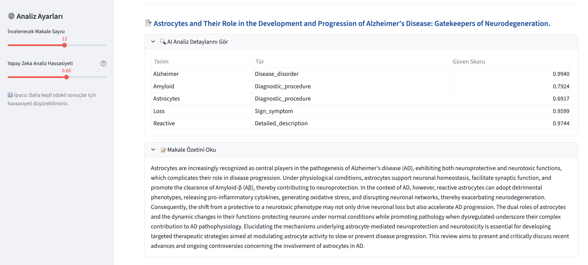
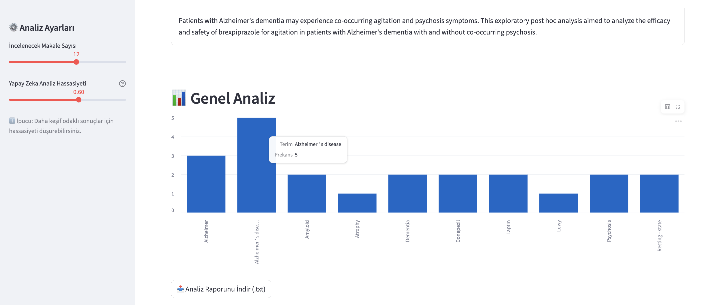

# 🧬 BioMiner: AI-Powered PubMed Literature Mining & NER


**BioMiner**, tıbbi literatürün kalbi olan PubMed üzerinde derinlemesine analiz yapan, **BioBERT** tabanlı bir **Named Entity Recognition (Varlık İsmi Tanıma)** aracıdır. Yazılım mühendisliği prensipleriyle geliştirilen bu sistem, binlerce makaleyi saniyeler içinde tarayarak genleri, hastalıkları ve ilaçları cımbızla çeker gibi ayıklar ve profesyonel raporlar sunar.

---

## 🚀 Canlı Demo (Live Demo)
Uygulamayı tarayıcınızda anında test edin:  
👉 **[BioMiner: Canlı Analiz Sistemi](https://bio-nlp-project-hdubr4y4vgisgh9kwa2wbc.streamlit.app/)**

---

## 📌 Proje Genel Bakış

Biyomedikal dünyasında her gün binlerce yeni makale yayınlanmaktadır. Bir araştırmacının tüm bu literatürü manuel olarak taraması imkansızdır. **BioMiner**, bu süreci otomatize ederek "bilgiden içgörüye" giden yolu kısaltır.

**Öne Çıkan Mühendislik Çözümleri:**
- **BioBERT Entegrasyonu:** Genel NLP modelleri yerine, tıbbi terimler için özel olarak PubMed makaleleriyle eğitilmiş **BioBERT** mimarisi kullanıldı.
- **Intelligent Caching (SQLite):** API limitlerini korumak ve performansı artırmak için SQLite tabanlı akıllı bir önbellekleme mekanizması kuruldu.
- **Modular Architecture:** Proje; `fetcher`, `processor` ve `UI` katmanlarına ayrılarak ölçeklenebilir ve sürdürülebilir hale getirildi.
- **Automated Reporting:** Analiz sonuçları, araştırmacıların kullanımına uygun profesyonel `.txt` raporları halinde dışa aktarılabilir.

---

## 🧠 Sistem Mimarisi (Architecture)

BioMiner, veri kaynağından kullanıcı arayüzüne kadar 3 ana katmandan oluşur:

1. **Data Layer (Fetcher):** PubMed API (Entrez) üzerinden veri çekme ve SQLite ile senkronize çalışma.
2. **AI Layer (Processor):** Transformers hattı üzerinden BioBERT modelinin koşturulması ve veri temizliği (Entity Cleaning).
3. **Presentation Layer (UI):** Streamlit üzerinde geliştirilmiş, teknik terimleri son kullanıcı için sadeleştiren interaktif dashboard.



---

## 🛠 Kullanılan Teknolojiler

| Kategori | Araçlar |
| :--- | :--- |
| **NLP & AI** | BioBERT (`d4data/biomedical-ner-all`), Hugging Face Transformers, PyTorch |
| **Data Engine** | Python Requests (E-utilities API), SQLite3, Pandas |
| **Arayüz (UI)** | Streamlit (Custom CSS & Interactive Components) |
| **Mühendislik** | Modular Programming, JSON/XML Parsing, Regex |

---

## 🔍 Öne Çıkan Özellikler

### 1. Akıllı Önbellekleme (Smart Caching)
Sistem, daha önce aratılan hastalıkları hafızasında tutar. Eğer kullanıcı 10 makale aratmışken bu sayıyı 20'ye çıkarırsa, sistem sadece aradaki eksik 10 makaleyi API'den çeker. Bu, gerçek dünya projelerindeki "verimlilik" (Efficiency) odaklı bir mühendislik yaklaşımıdır.

### 2. Derin NLP Analizi (Bio-NER)
Model, sadece kelime eşleşmesi yapmaz; cümle içindeki bağlamdan (context) yola çıkarak terimleri etiketler:
- **Genetik:** BRCA1, APOE, TP53...
- **Patolojik:** Neoplasm, Carcinoma, Inflammation...
- **Farmakolojik:** Metformin, Insulin, Aspirin...

### 3. Profesyonel Raporlama
Kullanıcılar, analiz edilen tüm makalelerin başlıklarını, özetlerini ve tespit edilen anahtar terimleri içeren bir **Literatür Raporunu (.txt)** anında indirebilir.

---

## 📊 Ekran Görüntüleri

<p align="center">
  
</p>

<br>
<p align="center">
  
</p>

<br>
<p align="center">
  
</p>
<br>

---

## ⚙️ Kurulum ve Çalıştırma

```bash
# Depoyu klonlayın
git clone [https://github.com/beyzahiz/Bio-NLP-Project.git](https://github.com/beyzahiz/Bio-NLP-Project.git)

# Proje dizinine gidin
cd Bio-NLP-Project

# Gerekli kütüphaneleri yükleyin
pip install -r requirements.txt

# Uygulamayı başlatın
streamlit run app.py
```

## İletişim
Linkedin: [linkedin.com/in/beyzahiz](https://www.linkedin.com/in/beyzahiz/) 
